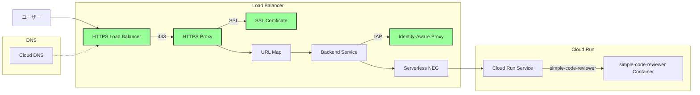

# Simple Code Reviewer

Google Gemini API を使用した Gradio ベースの AI チャットアプリケーション。

## 必要条件

- Python 3.10 以上
- [uv](https://github.com/astral-sh/uv)
- Google Cloud Platform プロジェクト
- Google Cloud Secret Manager に保存された Gemini API キー
- Docker (Docker を使用する場合)

## セービスアカウントの設定

Cloud Run でアプリケーションを実行するには、Secret Manager へのアクセス権限を持つサービスアカウントが必要です。以下の手順で設定を行ってください：

1. サービスアカウントの作成:

```bash
gcloud iam service-accounts create simple-code-reviewer --display-name="Simple Code Reviewer Service Account"
```

2. Secret Manager の閲覧権限を付与:

```bash
gcloud projects add-iam-policy-binding $PROJECT_ID \
  --member="serviceAccount:simple-code-reviewer@$PROJECT_ID.iam.gserviceaccount.com" \
  --role="roles/secretmanager.viewer"
```

3. シークレットへのアクセス権限を付与:

```bash
gcloud secrets add-iam-policy-binding gemini-api-key \
  --member="serviceAccount:simple-code-reviewer@$PROJECT_ID.iam.gserviceaccount.com" \
  --role="roles/secretmanager.secretAccessor"
```

注意事項：

- サービスアカウント名は `simple-code-reviewer` を使用します
- `$PROJECT_ID` は実際のプロジェクト ID に置き換えてください
- 権限は最小限に保つため、必要な Secret Manager の権限のみを付与しています
- IAM の権限が反映されるまで数分かかる場合があります

## セットアップと実行方法

### 通常の実行方法

1. uv を使用して依存関係をインストール:

```bash
uv sync
```

2. 「API キーと設定方法」セクションの手順に従って、API の設定を行ってください。

3. アプリケーションの実行:

```bash
uv run src/app.py
```

### Docker を使用した実行方法

1. 「API キーと設定方法」セクションの手順に従って、Secret Manager の設定を行ってください。

2. Google Cloud 認証を設定:

   ```bash
   gcloud auth application-default login
   ```

3. Makefile を使用して Docker イメージをビルド:

```bash
make build
```

4. アプリケーションの実行:

```bash
make run
```

5. イメージの削除（必要な場合）:

```bash
make clean
```

アプリケーションが起動すると、ブラウザで自動的に Gradio のインターフェースが開きます（http://localhost:7860）。

### Google Cloud Run へのデプロイ方法

1. Google Cloud CLI をインストールし、認証を設定:

```bash
gcloud auth login
gcloud config set project YOUR_GCP_PROJECT_ID
```

2. Cloud Build と Cloud Run API を有効化:

```bash
gcloud services enable cloudbuild.googleapis.com run.googleapis.com
```

3. サービスアカウントの設定:

   - 「サービスアカウントの設定」セクションの手順に従って、必要なサービスアカウントと権限を設定してください
   - この設定は Secret Manager からの API キーの取得に必要です

4. アプリケーションのデプロイ:

```bash
make deploy
```

デプロイが完了すると、Cloud Run の URL が表示されます。この URL にアクセスすることで、アプリケーションを使用できます。

注意事項：

- デプロイ前に `settings.py` の設定が正しく行われていることを確認してください
- Cloud Run へのデプロイには、適切な Google Cloud の権限が必要です
- デプロイ後、アプリケーションは自動的にスケーリングされます
- サービスアカウントが正しく設定されていることを確認してください

## 機能

- マルチライン入力に対応したコードレビューインターフェース
- Google Gemini API を使用した AI コードレビュー
- 日本語でのレビューに対応
- 使用例付き

## API キーと設定方法

`src/config/settings.py` を開き、以下の設定を行ってください：

```python
# Google Cloud Platform のプロジェクトID
# GCPのコンソールで確認できるプロジェクトIDを設定
PROJECT_ID = "YOUR_GCP_PROJECT_ID"

# Secret Manager に保存された Gemini API キーのシークレットID
# Google Cloud Secret Manager で作成したシークレットのID
GEMINI_API_KEY_SECRET_ID = "YOUR_GEMINI_API_KEY_SECRET_ID"
```

## API キーの設定手順

1. [Google AI Studio](https://makersuite.google.com/app/apikey)にアクセスし、API キーを作成
2. [Google Cloud Console](https://console.cloud.google.com/)で Secret Manager を開く
3. 新しいシークレットを作成し、Gemini API キーを保存
   - シークレット ID を設定（例: "gemini-api-key"）
   - シークレットの値として Gemini API キーを以下の形式で設定:
     ```json
     {
       "api_key": "YOUR_GEMINI_API_KEY"
     }
     ```
4. `settings.py` の設定を更新
   - `PROJECT_ID` に GCP プロジェクト ID を設定
   - `GEMINI_API_KEY_SECRET_ID` に作成したシークレット ID を設定


## terraform

### 構成図


### 変数の設定

`variables.tf`で以下の変数を環境に合わせて設定する必要があります：

```terraform
variable "project" {
  default = "your-project-id"    // GCPプロジェクトIDを設定
}

variable "project_number" {
  default = "your-project-number" // GCPプロジェクト番号を設定
}

variable "domain" {
  default = "your-domain.com"    // 使用するドメイン名を設定
}

variable "dns_managed_zone" {
  default = "your-dns-zone"      // Cloud DNSのゾーン名を設定
}

variable "iap_members" {
  default = [
    "user:example@example.com"   // IAPでアクセスを許可するユーザーのメールアドレスを設定
    // 複数のユーザーを追加可能
  ]
}
```

これらの値は、以下のいずれかの方法で設定できます：

1. `variables.tf`のデフォルト値を直接編集
2. `terraform.tfvars`ファイルを作成して値を設定
3. 環境変数で設定（例：`TF_VAR_project="your-project-id"`）
4. `terraform apply`実行時に対話的に入力

terraform.tfvarsのサンプル
```terraform
# GCPプロジェクトの設定
project        = "your-project-id"        # プロジェクトID
project_number = "your-project-number"    # プロジェクト番号
region         = "asia-northeast1"        # リージョン

# ドメインとDNSの設定
domain           = "your-domain.com"      # 使用するドメイン
dns_managed_zone = "your-dns-zone"        # Cloud DNSのゾーン名

# IAPアクセス許可メンバー
iap_members = [
  "user:example@example.com",
  # 必要に応じて他のメンバーを追加
  # "user:another@example.com",
  # "group:team@example.com",
]
```

### terraform の実行方法

```bash
# ログイン
gcloud auth application-default login

cd terraform
terraform init
terraform plan
terraform apply
```
注意：SSL 証明書のプロビジョニングと検証には時間がかかる場合があります（通常 15-30 分程度）。 証明書のステータスは以下のコマンドで確認できます：

```shell
terraform output certificate_status
```

### アクセス

以下のコマンドで、デプロイされた環境の情報を確認できます：

```shell
$ terraform output
certificate_status = {
  "create_time" = "2021-09-01T00:00:00.000-07:00"
  "expire_time" = "2021-12-01T00:00:00.000-07:00"
  "id" = "your-certificate-id"
}
domain = "your-domain.com"
lb_ip = "xxx.xxx.xxx.xxx"
url = "https://your-domain.com"
```

アプリケーションには `url` で表示された URL からアクセスできます。
なお、以下の点に注意してください：

- DNS の伝播に時間がかかる場合があります（通常 5-30 分程度）
- SSL 証明書の検証が完了するまで HTTPS アクセスができません
- 証明書のステータスは `terraform output certificate_status` で確認できます
